# Security Plan Manager

A multi-tenant NIST CSF 2.0 workspace for assessing brands, tracking Current vs Target posture, attaching evidence, managing software inventory, and publishing frozen board scorecards.

Security Plan Manager is built for CISOs, assessors, control owners, auditors, and board viewers who need a shared organizational profile rather than a static spreadsheet.

## Features

### Program and brands

- Create an organization and one or more brands, each with a period profile (for example `2026-Q3`).
- The menu shows brands under **Program**. Assessment, evidence, reports, publish, and software inventory sit under each brand.

### NIST CSF 2.0 scoring

- Catalog is the CSF 2.0 Core: 6 functions, 22 categories, and 106 subcategories.
- Brand dashboards show overall Current and Target (0–100, derived from CSF Tiers), coverage, evidence counts, and function cards.
- Inline Current and Target tier editors on the organizational profile, with an optional comment when a value changes.
- Click an outcome to open a details panel with the abbreviation, full function/category/outcome text, profile inclusion, rationale, Current/Target fields, and edit history.

### Highest brand risks

- Live dashboards “Largest gaps” with **Highest brand risks**.
- NIST CSF Current vs Target gaps are ranked first.
- Unresolved installed-app CVEs appear only when CVSS is above 7.5 (only from a BOD highest risk standpoint), grouped by product so one application cannot fill the list (at most two CVE slots).

### Software inventory and CVEs

- Per-brand inventory of applications (product, company, version, category, notes).
- Active products are matched against a rolling 120-day CVE catalog by product name.
- Export a CSV template of the active list, edit it outside the app, and re-import: new rows are added, rows that keep their `id` are updated, and removed rows are archived.
- Login alerts surface outstanding matches between application in use and CVE's, this also happens if you add an application that has a recent CVE.
- Dashboard and report insight cards count unique **application + CVE date**, so one product with many same-day CVEs is one exposure, not hundreds.

### Evidence and history

- Evidence locker holds URLs, notes, and file attachments linked to subcategory assessments.
- History records Current and Target changes with who made them and any comment.

### Board reports

- Live Current vs Target scores on brand dashboards. Publish a dated snapshot as a frozen checkpoint.
- Reports are brand-specific and linked under each brand in the menu. Opening a snapshot shows the scorecard as of publish time.
- Published scorecards include a plain-language explanation of each NIST function (Govern, Identify, Protect, Detect, Respond, Recover) for board readers.
- Snapshots freeze **Highest brand risks** and software/CVE insight counts. 

### People

- Roster with role changes, deactivate, and reactivate.
- Invite by email with a shareable link. Only owners can assign the owner role.

### Roles and access

- Per-organization roles with **None / View / Edit** for Program, Assessment, Evidence, History, Reports, People, Roles, and Software inventory. Edit includes View.
- Brand access is defined on the role (all brands or selected brands), not on each person.
- Add custom roles, optionally copying permissions and brand access from an existing role.

### Accounts

- Email/password sign-in and sign-up.
- New accounts create an organization, first brand, and a full CSF 2.0 profile for the current period.
- Demo tenant is seeded with scored assessments, evidence, software inventory, and published board snapshots.

## Stack

Next.js App Router, Auth.js (credentials JWT), Prisma, and PostgreSQL.

## Setup

1. Copy `.env.example` to `.env` and set `AUTH_SECRET`. Set `CVE_SYNC_SECRET` before exposing the daily CVE sync HTTP endpoint. Demo accounts and the demo tenant seed are on by default in development; set `DEMO_LOGIN=0` or run in production to hide them.
2. Start Postgres. Prefer Docker (`docker compose up -d`). If Docker is not installed, run a workspace-local cluster with `npm run db:start`.
3. Push schema and seed the CSF catalog:

```
npx prisma generate
npx prisma db push
npx prisma db seed
```

The seed loads 6 functions, 22 categories, and 106 subcategories, then a demo tenant with scored assessments, evidence, and published board snapshots.

4. Run the app: `npm run dev`

Optional CVE jobs:

```
npm run cve:sync
```

## Demo login

Shown on `/login` in development, or when `DEMO_LOGIN=1`. Do not seed or expose these accounts on a public host.

| Role | Email | Password |
| --- | --- | --- |
| CISO | `ciso@apex.example` | `ChangeMe123!` |
| Assessor | `analyst@apex.example` | `ChangeMe123!` |
| Board viewer | `board@apex.example` | `ChangeMe123!` |

Apex Retail is a published 2026-Q3 profile for dashboards, software inventory, and board reports. Apex Wholesale is a lower-coverage draft.

## First use

You can also create a new account, then an organization and brand. That generates a period profile with every CSF 2.0 subcategory. Assess Current vs Target tiers, attach evidence, record software, and publish a frozen board snapshot.

## Screenshots

### Sign in

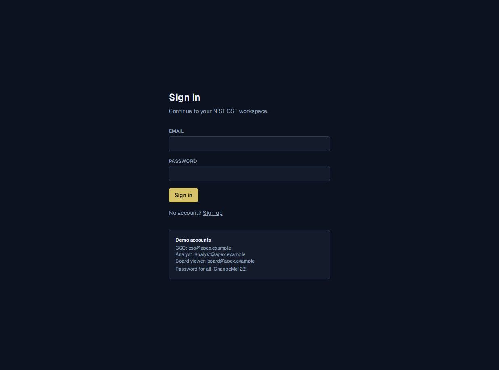

### Program

Brand list with Current, Target, and coverage, plus creating another brand.

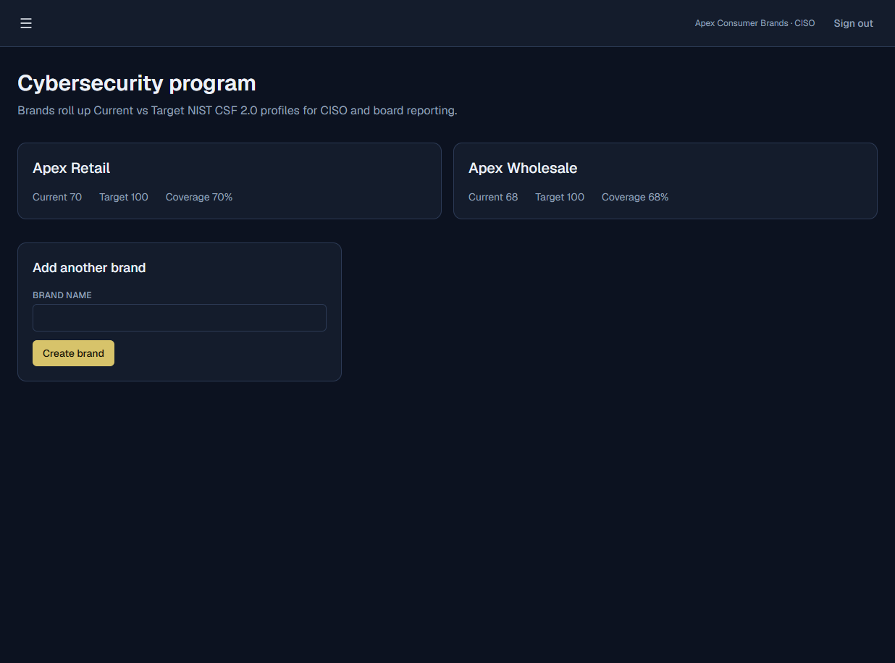

### Brand dashboard

Live CISO view of NIST CSF 2.0 functions, highest brand risks, and software/CVE insights.

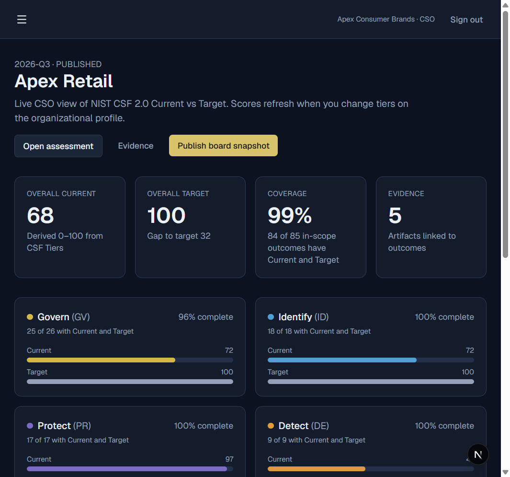

### Navigation

Hamburger menu with each brand’s assessment, evidence, reports, publish, and software inventory links.

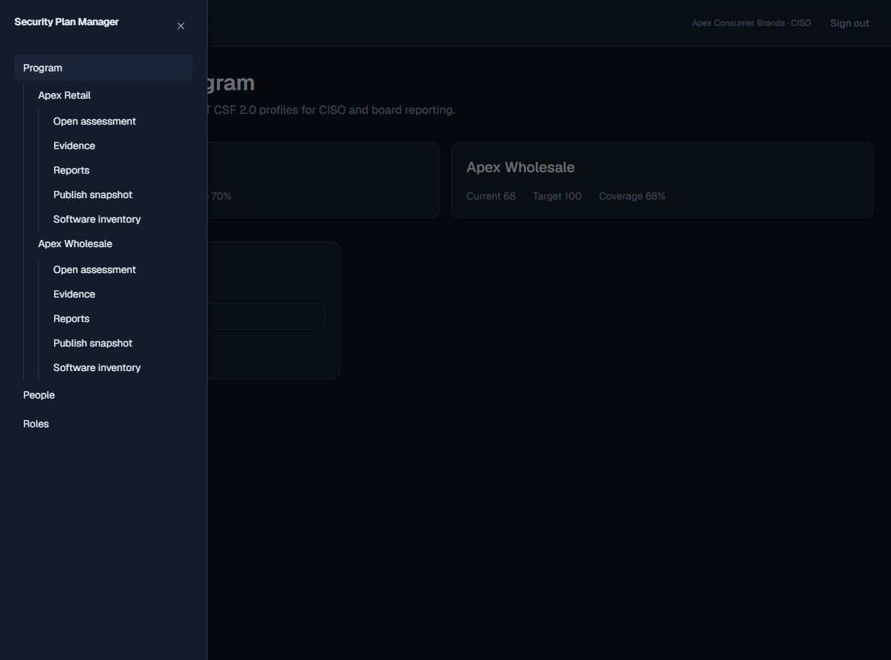

### Organizational profile

Inline Current and Target scoring for CSF 2.0 outcomes.

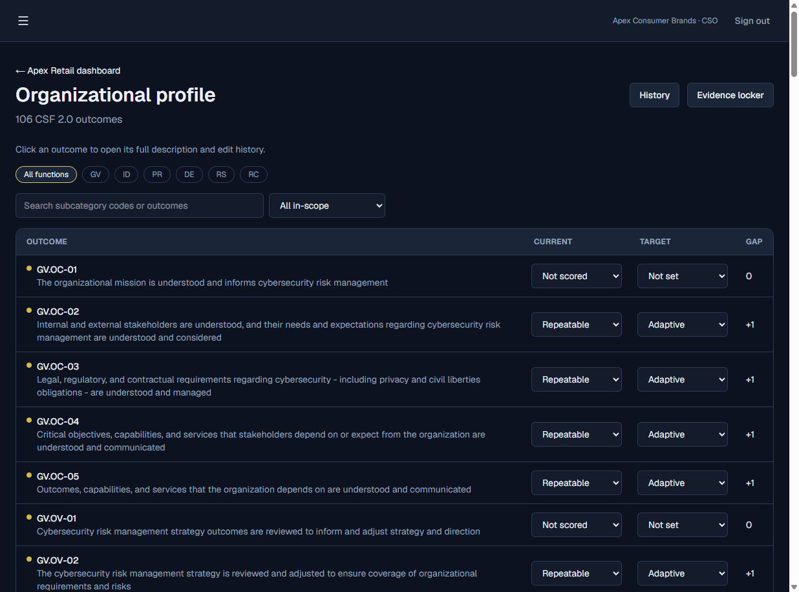

### Outcome details

Click an outcome for the full text, inclusion, Current/Target fields, and edit history.

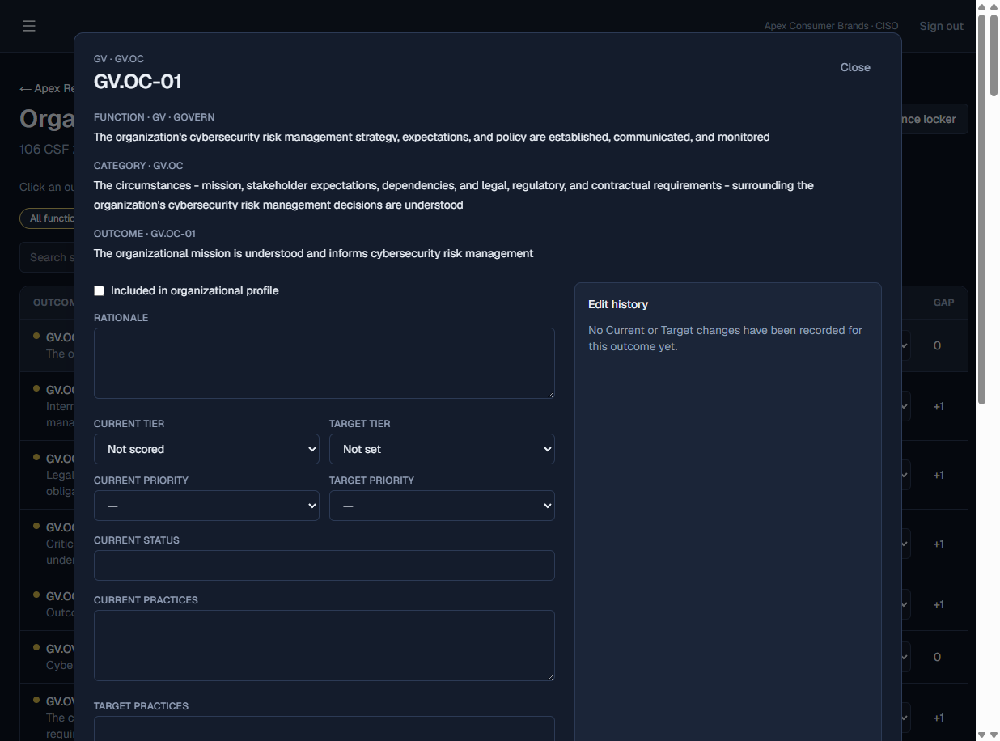

### Assessment history

Current and Target changes with comments.

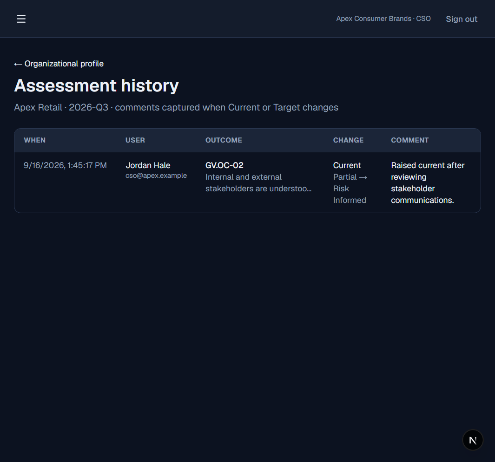

### Evidence locker

Files, URLs, and notes linked to subcategory assessments.

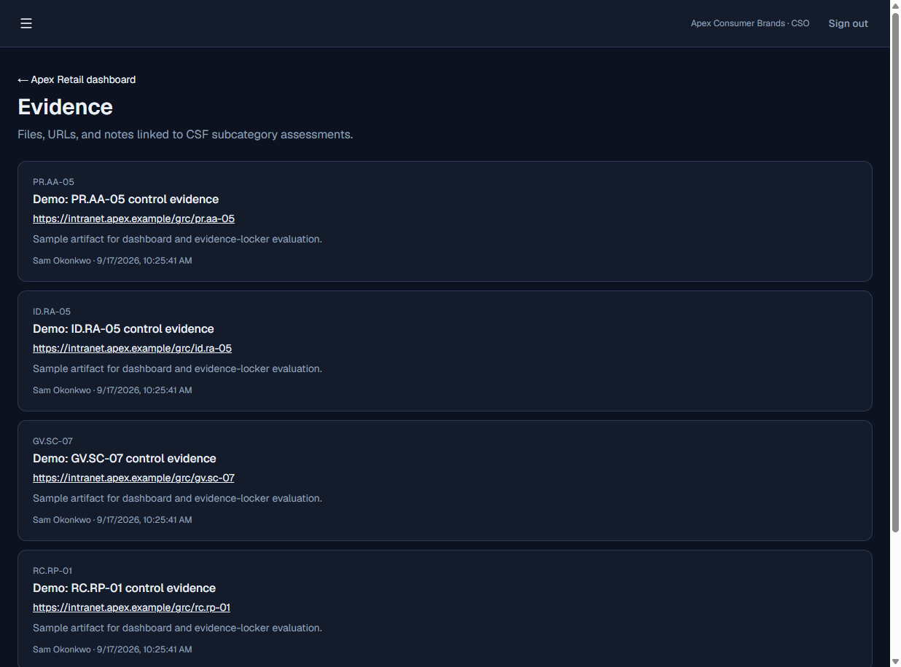

### Brand reports

Published checkpoints for one brand.

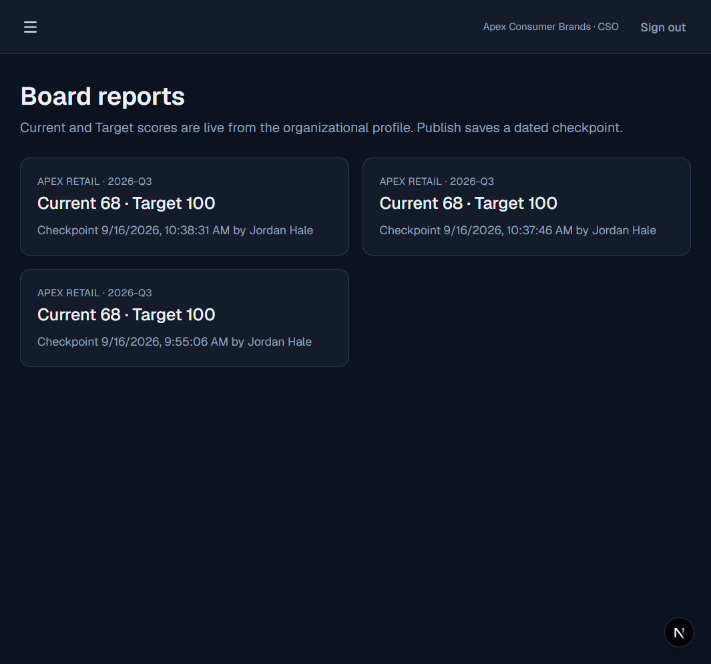

### Board scorecard

Frozen function scores, NIST function explanations, and highest brand risks or largest gaps.

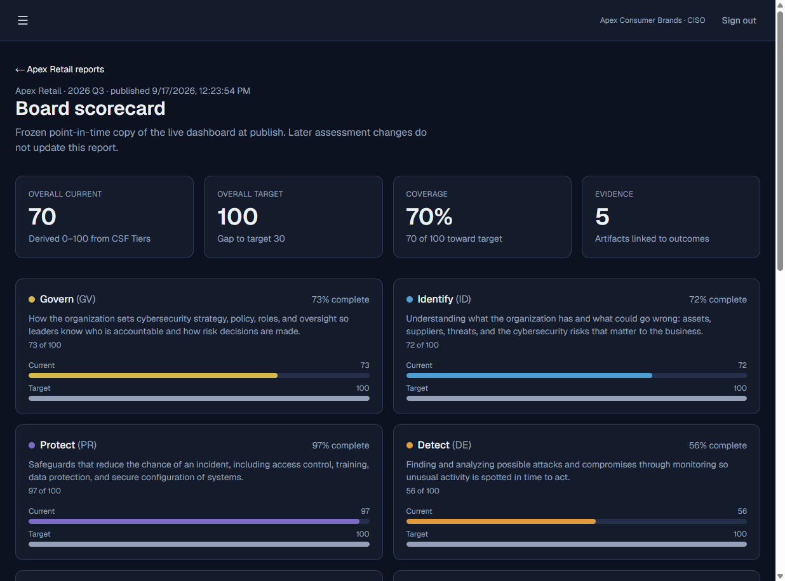

### Software inventory

Active applications, category filter, collapsed add form, and CSV import/export. Archived items stay hidden until you choose View archived.

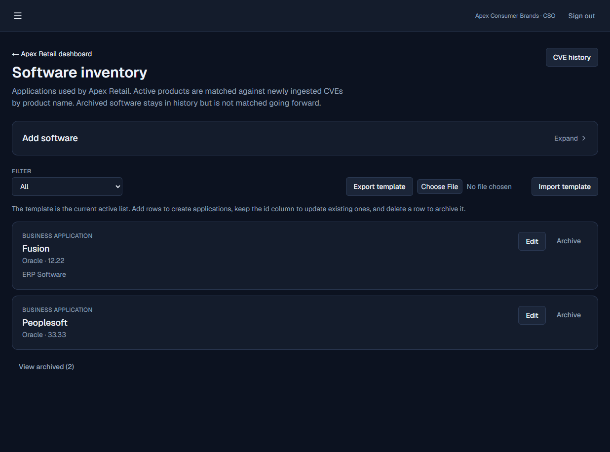

### People

Change roles, deactivate people, and invite teammates. Brand access comes from the role.

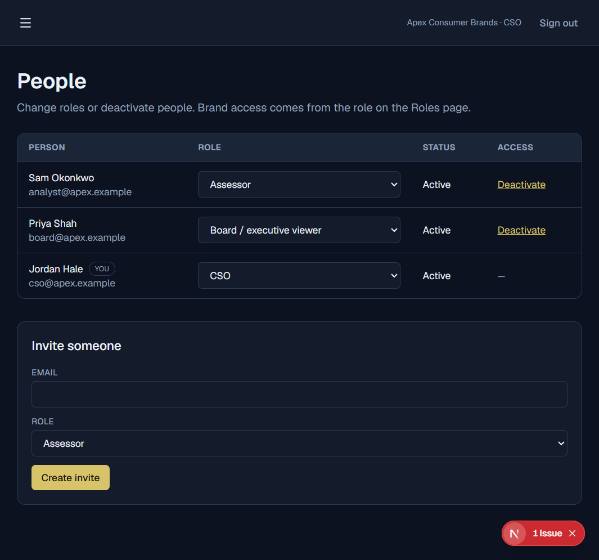

### Roles

Add or delete roles, set View/Edit by product area, and choose which brands the role can open.

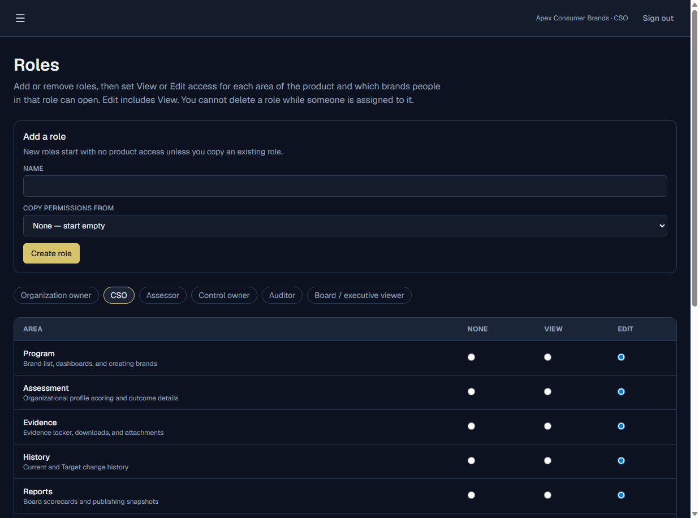

## License

This project is licensed under the MIT License. See [LICENSE](LICENSE).
